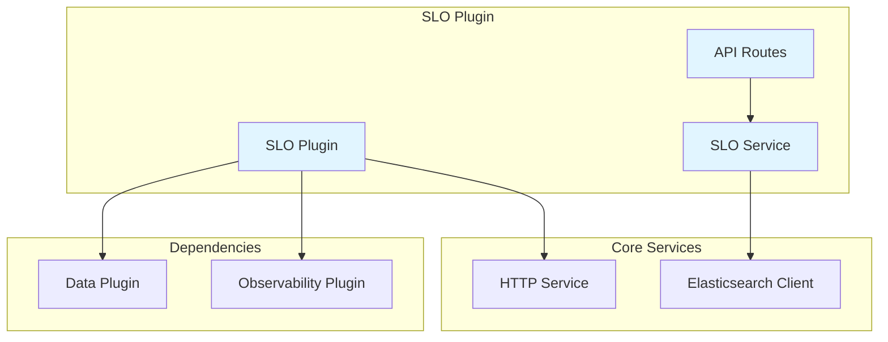
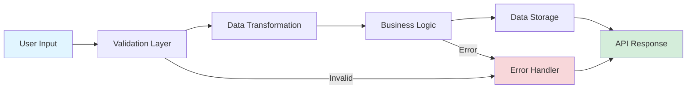
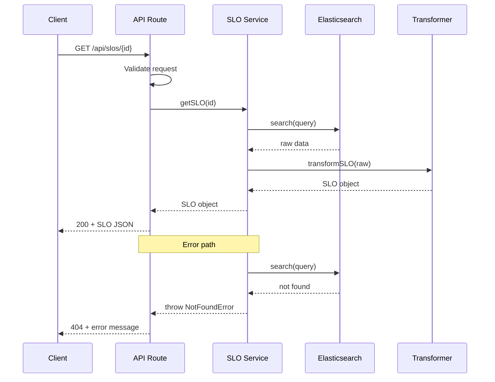

# @doc-generator

**Purpose:** Generate comprehensive technical documentation from code, tests, and git history. Integrates deeply with Kibana conventions (versioned routes, io-ts/Zod schemas, Scout tests).

---

## When to Use

**Automatic activation triggers:**
- "generate API docs" / "API documentation" / "OpenAPI spec"
- "create architecture diagram" / "Mermaid diagram" / "system diagram"
- "update README" / "refresh README"
- "generate changelog" / "CHANGELOG.md"
- "generate user guide" / "user documentation"
- "document this" / "write documentation"

**Manual invocation:**
```
/doc-generator
```

---

## Core Capabilities

### 1. API Documentation Generation

**From:** Kibana versioned route definitions with io-ts or Zod schemas
**To:** OpenAPI spec + Markdown API reference

#### Step 1.1: Detect Route Files

```bash
# Find all route definition files
find <package-path> -type f \( -name "*.route.ts" -o -name "*_route.ts" -o -path "*/routes/*.ts" \)
```

**Look for patterns:**
- `router.versioned.post()` / `.get()` / `.put()` / `.delete()`
- `path: '/api/<plugin>/<resource>'`
- `validate: { request: { body: schema.object(...) } }`
- io-ts: `t.type()`, `t.partial()`, `t.intersection()`
- Zod: `z.object()`, `z.string()`, `z.number()`

#### Step 1.2: Extract Route Metadata

For each route, extract:
- **Method:** GET, POST, PUT, DELETE
- **Path:** `/api/<plugin>/<resource>`
- **Access:** `internal` / `public`
- **Security:** `authz.requiredPrivileges`
- **Versioning:** `version: '1'`, `version: '2'`
- **Request schema:** Body, query params, path params
- **Response schema:** Success (200), errors (400, 404, 500)

**Example extraction:**

```typescript
// Input: x-pack/plugins/slo/server/routes/get_slo.ts
router.versioned
  .get({
    path: '/api/observability/slos/{id}',
    access: 'public',
    security: {
      authz: {
        requiredPrivileges: ['slo', 'read'],
      },
    },
  })
  .addVersion(
    {
      version: '1',
      validate: {
        request: {
          params: t.type({ id: sloIdSchema }),
          query: t.partial({ instanceId: t.string }),
        },
      },
    },
    async (context, request, response) => { ... }
  );

// Extracted metadata:
{
  method: "GET",
  path: "/api/observability/slos/{id}",
  access: "public",
  privileges: ["slo", "read"],
  version: "1",
  params: { id: "string (UUID)" },
  query: { instanceId: "string (optional)" },
  responses: {
    200: "SLO object",
    404: "SLO not found",
    500: "Internal error"
  }
}
```

#### Step 1.3: Generate OpenAPI Spec

**Output format:** OpenAPI 3.0 YAML

```yaml
openapi: 3.0.0
info:
  title: <Plugin> API
  version: 1.0.0
  description: Generated from Kibana route definitions

paths:
  /api/observability/slos/{id}:
    get:
      summary: Get SLO by ID
      operationId: getSLO
      tags:
        - SLO
      security:
        - kibana_auth:
            - slo:read
      parameters:
        - name: id
          in: path
          required: true
          schema:
            type: string
            format: uuid
          description: SLO identifier
        - name: instanceId
          in: query
          required: false
          schema:
            type: string
          description: Optional instance ID filter
      responses:
        '200':
          description: SLO retrieved successfully
          content:
            application/json:
              schema:
                $ref: '#/components/schemas/SLOResponse'
        '404':
          description: SLO not found
          content:
            application/json:
              schema:
                $ref: '#/components/schemas/ErrorResponse'
        '500':
          description: Internal server error
          content:
            application/json:
              schema:
                $ref: '#/components/schemas/ErrorResponse'

components:
  schemas:
    SLOResponse:
      type: object
      properties:
        id:
          type: string
          format: uuid
        name:
          type: string
        # ... (derive from response schema)
    ErrorResponse:
      type: object
      properties:
        message:
          type: string
        statusCode:
          type: integer
```

**Save to:** `docs/openapi/<plugin>_api.yaml`

#### Step 1.4: Generate Markdown API Reference

**Output format:** Readable markdown docs

```markdown
# <Plugin> API Reference

Auto-generated from route definitions on [YYYY-MM-DD]

## Endpoints

### GET /api/observability/slos/{id}

Get SLO by ID

**Access:** Public
**Required privileges:** `slo:read`
**Version:** 1

#### Parameters

**Path:**
- `id` (string, required): SLO identifier (UUID format)

**Query:**
- `instanceId` (string, optional): Filter by instance ID

#### Request Example

```bash
curl -X GET "http://localhost:5601/api/observability/slos/123e4567-e89b-12d3-a456-426614174000?instanceId=prod" \
  -H "kbn-xsrf: true" \
  -u elastic:password
```

#### Response Examples

**Success (200):**
```json
{
  "id": "123e4567-e89b-12d3-a456-426614174000",
  "name": "API Availability",
  "indicator": { ... },
  "objective": { "target": 0.99 }
}
```

**Error (404):**
```json
{
  "statusCode": 404,
  "message": "SLO not found"
}
```

---
```

**Save to:** `docs/api/<plugin>_api_reference.md`

#### Step 1.5: Schema Conversion Helpers

**io-ts to JSON Schema:**

```typescript
// Convert io-ts types to JSON Schema
const ioTsToJsonSchema = (schema: t.Type<any>): JSONSchema => {
  if (schema instanceof t.StringType) return { type: 'string' };
  if (schema instanceof t.NumberType) return { type: 'number' };
  if (schema instanceof t.BooleanType) return { type: 'boolean' };
  if (schema instanceof t.ArrayType) return {
    type: 'array',
    items: ioTsToJsonSchema(schema._tag)
  };
  if (schema instanceof t.InterfaceType) return {
    type: 'object',
    properties: Object.entries(schema.props).reduce((acc, [key, val]) => ({
      ...acc,
      [key]: ioTsToJsonSchema(val)
    }), {}),
    required: Object.keys(schema.props)
  };
  if (schema instanceof t.PartialType) return {
    type: 'object',
    properties: Object.entries(schema.props).reduce((acc, [key, val]) => ({
      ...acc,
      [key]: ioTsToJsonSchema(val)
    }), {})
    // No required fields
  };
  // Handle more complex types...
};
```

**Zod to JSON Schema:**

```typescript
// Zod has built-in JSON Schema generation
import { zodToJsonSchema } from 'zod-to-json-schema';

const jsonSchema = zodToJsonSchema(zodSchema);
```

---

### 2. Architecture Diagram Generation

**From:** Code structure (imports, dependencies, class/function definitions)
**To:** Mermaid diagrams (component, data flow, sequence)

#### Step 2.1: Analyze Code Structure

```bash
# Analyze package structure
find <package-path> -type f -name "*.ts" -o -name "*.tsx"
```

**Extract:**
- **Imports:** What does this module depend on?
- **Exports:** What public API does it expose?
- **Classes/Functions:** What are the main components?
- **Plugin lifecycle:** setup, start, stop methods
- **Service dependencies:** What services does it consume?

**Example analysis:**

```typescript
// Input: x-pack/plugins/slo/server/plugin.ts

import { PluginSetup as DataPluginSetup } from '@kbn/data-plugin/server';
import { ObservabilityPluginSetup } from '@kbn/observability-plugin/server';

export class SloPlugin implements Plugin {
  setup(core: CoreSetup, plugins: {
    data: DataPluginSetup,
    observability: ObservabilityPluginSetup
  }) {
    // Register routes
    this.router = core.http.createRouter();
    registerRoutes(this.router);

    // Register services
    this.sloService = new SLOService(plugins.data.search);
  }

  start(core: CoreStart) { ... }
  stop() { ... }
}

// Extracted structure:
{
  type: "plugin",
  dependencies: ["@kbn/data-plugin", "@kbn/observability-plugin"],
  services: ["SLOService"],
  routes: ["registerRoutes"],
  lifecycle: ["setup", "start", "stop"]
}
```

#### Step 2.2: Generate Component Diagram

**Auto-detect diagram type:**
- Plugin with dependencies → Component diagram
- Service with methods → Class diagram
- API flow → Sequence diagram
- Data transformations → Data flow diagram

**Component diagram (plugin architecture):**



**Save to:** `docs/architecture/<plugin>_component_diagram.md`

#### Step 2.3: Generate Data Flow Diagram

**For data processing pipelines:**



#### Step 2.4: Generate Sequence Diagram

**For API request flows:**



#### Step 2.5: Diagram Selection Logic

```typescript
const selectDiagramType = (codeAnalysis) => {
  // Plugin with dependencies → Component diagram
  if (codeAnalysis.type === 'plugin' && codeAnalysis.dependencies.length > 0) {
    return 'component';
  }

  // API routes with request/response flow → Sequence diagram
  if (codeAnalysis.hasRoutes && codeAnalysis.hasServiceCalls) {
    return 'sequence';
  }

  // Data transformations → Data flow diagram
  if (codeAnalysis.hasTransformations || codeAnalysis.hasPipelines) {
    return 'dataflow';
  }

  // Classes with methods → Class diagram
  if (codeAnalysis.hasClasses && codeAnalysis.hasInheritance) {
    return 'class';
  }

  // Default: Component diagram
  return 'component';
};
```

---

### 3. User Guide Generation from Scout Tests

**From:** Scout E2E test steps
**To:** User-facing step-by-step guide with screenshots

#### Step 3.1: Extract Test Flow

**Input:** Scout test file (`.spec.ts`)

```typescript
test.describe('Create SLO', () => {
  test('create SLO with APM indicator', async ({ page, pageObjects }) => {
    await test.step('navigate to SLO creation page', async () => {
      await pageObjects.slo.gotoCreatePage();
      await expect(page.getByTestId('slo-create-form')).toBeVisible();
    });

    await test.step('fill SLO details', async () => {
      await page.getByTestId('slo-name-input').fill('API Availability');
      await page.getByTestId('slo-description-input').fill('Track API uptime');
    });

    await test.step('select APM indicator', async () => {
      await page.getByTestId('indicator-type-select').click();
      await page.getByText('APM Availability').click();
    });

    await test.step('configure objective', async () => {
      await page.getByTestId('slo-target-input').fill('99');
      await page.getByTestId('slo-timewindow-select').selectOption('30d');
    });

    await test.step('save SLO', async () => {
      await page.getByTestId('slo-create-save-button').click();
      await expect(page.getByText('SLO created successfully')).toBeVisible();
    });
  });
});
```

**Extract steps:**
1. Navigate to SLO creation page
2. Fill SLO details (name, description)
3. Select APM indicator
4. Configure objective (target, time window)
5. Save SLO

#### Step 3.2: Generate User Guide

**Output:** User-friendly markdown guide

```markdown
# How to Create an SLO

This guide walks you through creating a Service Level Objective (SLO) using the APM availability indicator.

## Prerequisites
- Access to Kibana Observability
- APM data ingested in Elasticsearch

---

## Step 1: Navigate to SLO Creation Page

1. Open Kibana in your browser
2. Go to **Observability → SLOs**
3. Click **Create SLO** button


---

## Step 2: Fill SLO Details

1. In the **Name** field, enter a descriptive name for your SLO
   - Example: "API Availability"
2. In the **Description** field, explain what this SLO tracks
   - Example: "Track API uptime for production environment"


---

## Step 3: Select Indicator Type

1. Click the **Indicator Type** dropdown
2. Select **APM Availability** from the list


---

## Step 4: Configure Objective

1. In the **Target** field, enter your desired success percentage
   - Example: 99 (for 99% availability)
2. In the **Time Window** dropdown, select the evaluation period
   - Example: 30 days


---

## Step 5: Save SLO

1. Click **Create SLO** button at the bottom of the form
2. Wait for the success confirmation message


---

## What's Next?

- **View SLO details:** Click on the newly created SLO to see its current status
- **Configure alerts:** Set up alerts when the SLO is breached
- **Monitor SLO burn rate:** Track how quickly your error budget is being consumed

---

## Troubleshooting

**Problem:** "APM Availability" indicator not visible
**Solution:** Ensure APM data is being ingested. Check APM Services page first.

**Problem:** Save button is disabled
**Solution:** Verify all required fields (Name, Indicator, Target) are filled correctly.

**Problem:** "SLO already exists" error
**Solution:** SLO names must be unique. Choose a different name.
```

**Save to:** `docs/user_guides/create_slo.md`

#### Step 3.3: Screenshot Integration

**Scout tests capture screenshots automatically:**

```typescript
// In test, capture screenshot at key steps
await test.step('navigate to SLO creation page', async () => {
  await pageObjects.slo.gotoCreatePage();
  await page.screenshot({ path: 'screenshots/create_slo_01_list_page.png' });
});
```

**Reference screenshots in user guide:**

```markdown

```

**Screenshot naming convention:**
- `<feature>_<step-number>_<description>.png`
- Example: `create_slo_01_list_page.png`, `create_slo_02_details.png`

---

### 4. README Update Automation

**From:** Package changes (git diff, exports, dependencies)
**To:** Updated README sections

#### Step 4.1: Detect Package Changes

```bash
# Get changed files in package
git diff --name-only HEAD~1 HEAD | grep "^<package-path>/"

# Check for specific change types
git diff HEAD~1 HEAD <package-path>/package.json  # Dependencies changed
git diff HEAD~1 HEAD <package-path>/index.ts      # Exports changed
git diff HEAD~1 HEAD <package-path>/README.md     # README exists
```

#### Step 4.2: Analyze Changes

**Change type detection:**

```typescript
const analyzePackageChanges = async (packagePath: string) => {
  const changes = {
    dependencies: false,
    exports: false,
    newFunctions: [],
    removedFunctions: [],
    changedAPI: false,
  };

  // Check package.json diff
  const packageJsonDiff = await gitDiff(`${packagePath}/package.json`);
  if (packageJsonDiff.includes('"dependencies"') || packageJsonDiff.includes('"devDependencies"')) {
    changes.dependencies = true;
  }

  // Check index.ts/tsx diff
  const indexDiff = await gitDiff(`${packagePath}/index.ts*`);
  const exportRegex = /export\s+(?:const|function|class|interface|type)\s+(\w+)/g;
  const addedExports = [...indexDiff.match(/^\+.*export/gm) || []];
  const removedExports = [...indexDiff.match(/^-.*export/gm) || []];

  changes.newFunctions = addedExports.map(e => e.match(exportRegex)?.[1]).filter(Boolean);
  changes.removedFunctions = removedExports.map(e => e.match(exportRegex)?.[1]).filter(Boolean);
  changes.changedAPI = changes.newFunctions.length > 0 || changes.removedFunctions.length > 0;

  return changes;
};
```

#### Step 4.3: Update README Sections

**Installation section (if dependencies changed):**

```markdown
## Installation

\`\`\`bash
yarn add @kbn/your-package
\`\`\`

### Peer Dependencies

This package requires:
- `@kbn/core` >= 9.0.0
- `react` >= 18.0.0
```

**API Reference section (if exports changed):**

```markdown
## API Reference

### New Functions

#### `processData(input: DataInput): DataOutput`

Process raw data and return transformed output.

**Parameters:**
- `input` (DataInput): Raw data object

**Returns:** DataOutput - Processed data

**Example:**
\`\`\`typescript
import { processData } from '@kbn/your-package';

const result = processData({ id: '123', value: 42 });
console.log(result); // { id: '123', transformed: 84 }
\`\`\`

### Removed Functions

The following functions have been removed in this version:
- ~~`oldFunction()`~~ - Use `processData()` instead
```

**Examples section (if usage patterns changed):**

```markdown
## Usage Examples

### Basic Usage

\`\`\`typescript
import { processData } from '@kbn/your-package';

const data = { id: '123', value: 42 };
const result = processData(data);
\`\`\`

### Advanced Usage

\`\`\`typescript
import { processData, validateInput } from '@kbn/your-package';

// Validate before processing
if (validateInput(data)) {
  const result = processData(data);
}
\`\`\`
```

#### Step 4.4: README Update Workflow

```typescript
const updateReadme = async (packagePath: string) => {
  const changes = await analyzePackageChanges(packagePath);
  const readmePath = `${packagePath}/README.md`;
  const readme = await readFile(readmePath);

  let updatedReadme = readme;

  // Update Installation section if dependencies changed
  if (changes.dependencies) {
    updatedReadme = updateSection(updatedReadme, '## Installation', generateInstallationSection());
  }

  // Update API Reference if exports changed
  if (changes.changedAPI) {
    updatedReadme = updateSection(updatedReadme, '## API Reference', generateAPIReferenceSection(changes));
  }

  // Update Examples if new functions added
  if (changes.newFunctions.length > 0) {
    updatedReadme = updateSection(updatedReadme, '## Usage Examples', generateExamplesSection(changes.newFunctions));
  }

  await writeFile(readmePath, updatedReadme);
};
```

---

### 5. Changelog Generation

**From:** Git commits (conventional commit format)
**To:** CHANGELOG.md entry

#### Step 5.1: Parse Git Commits

```bash
# Get commits since last tag
git log $(git describe --tags --abbrev=0)..HEAD --oneline

# Parse conventional commit format: type(scope): message
# Examples:
# feat(slo): add APM availability indicator
# fix(slo): correct burn rate calculation
# refactor(slo): simplify data transformation
# docs(slo): update API reference
# test(slo): add Scout E2E tests
```

**Conventional commit types:**
- `feat`: New feature
- `fix`: Bug fix
- `refactor`: Code refactoring (no behavior change)
- `docs`: Documentation changes
- `test`: Test additions/changes
- `chore`: Tooling/config changes
- `perf`: Performance improvements
- `style`: Code style changes (formatting)
- `ci`: CI/CD changes
- `build`: Build system changes

#### Step 5.2: Categorize Commits

```typescript
const parseCommits = async (since: string = 'HEAD~10') => {
  const commits = await gitLog(since);
  const categorized = {
    features: [],
    fixes: [],
    refactors: [],
    docs: [],
    tests: [],
    other: [],
  };

  const conventionalCommitRegex = /^(feat|fix|refactor|docs|test|chore|perf|style|ci|build)(\([\w-]+\))?:\s*(.+)$/;

  for (const commit of commits) {
    const match = commit.message.match(conventionalCommitRegex);
    if (!match) {
      categorized.other.push(commit);
      continue;
    }

    const [, type, scope, message] = match;
    const entry = {
      hash: commit.hash,
      type,
      scope: scope?.replace(/[()]/g, ''),
      message: message.trim(),
      author: commit.author,
      date: commit.date,
    };

    switch (type) {
      case 'feat':
        categorized.features.push(entry);
        break;
      case 'fix':
        categorized.fixes.push(entry);
        break;
      case 'refactor':
      case 'perf':
        categorized.refactors.push(entry);
        break;
      case 'docs':
        categorized.docs.push(entry);
        break;
      case 'test':
        categorized.tests.push(entry);
        break;
      default:
        categorized.other.push(entry);
    }
  }

  return categorized;
};
```

#### Step 5.3: Generate Changelog Entry

**Output format:**

```markdown
## [Version] - YYYY-MM-DD

### Features
- **slo:** Add APM availability indicator ([#12345](link)) ([abc1234](commit))
- **slo:** Support custom time windows ([#12346](link)) ([def5678](commit))

### Bug Fixes
- **slo:** Correct burn rate calculation for rolling windows ([#12347](link)) ([ghi9012](commit))
- **api:** Fix 500 error when SLO not found ([#12348](link)) ([jkl3456](commit))

### Refactoring
- **slo:** Simplify data transformation logic ([abc1234](commit))
- **api:** Extract validation to separate module ([def5678](commit))

### Documentation
- **slo:** Update API reference with new endpoints ([abc1234](commit))
- **readme:** Add usage examples for APM indicator ([def5678](commit))

### Tests
- **slo:** Add Scout E2E tests for SLO creation ([abc1234](commit))
- **api:** Add integration tests for error scenarios ([def5678](commit))

---
```

#### Step 5.4: Changelog Update Workflow

```typescript
const generateChangelog = async (version: string, since: string = 'HEAD~10') => {
  const commits = await parseCommits(since);
  const date = new Date().toISOString().split('T')[0]; // YYYY-MM-DD

  let changelog = `## [${version}] - ${date}\n\n`;

  // Features
  if (commits.features.length > 0) {
    changelog += '### Features\n';
    for (const commit of commits.features) {
      const scope = commit.scope ? `**${commit.scope}:** ` : '';
      changelog += `- ${scope}${commit.message} ([${commit.hash.slice(0, 7)}](commit-link))\n`;
    }
    changelog += '\n';
  }

  // Bug Fixes
  if (commits.fixes.length > 0) {
    changelog += '### Bug Fixes\n';
    for (const commit of commits.fixes) {
      const scope = commit.scope ? `**${commit.scope}:** ` : '';
      changelog += `- ${scope}${commit.message} ([${commit.hash.slice(0, 7)}](commit-link))\n`;
    }
    changelog += '\n';
  }

  // Refactoring
  if (commits.refactors.length > 0) {
    changelog += '### Refactoring\n';
    for (const commit of commits.refactors) {
      const scope = commit.scope ? `**${commit.scope}:** ` : '';
      changelog += `- ${scope}${commit.message} ([${commit.hash.slice(0, 7)}](commit-link))\n`;
    }
    changelog += '\n';
  }

  // Documentation
  if (commits.docs.length > 0) {
    changelog += '### Documentation\n';
    for (const commit of commits.docs) {
      const scope = commit.scope ? `**${commit.scope}:** ` : '';
      changelog += `- ${scope}${commit.message} ([${commit.hash.slice(0, 7)}](commit-link))\n`;
    }
    changelog += '\n';
  }

  // Tests
  if (commits.tests.length > 0) {
    changelog += '### Tests\n';
    for (const commit of commits.tests) {
      const scope = commit.scope ? `**${commit.scope}:** ` : '';
      changelog += `- ${scope}${commit.message} ([${commit.hash.slice(0, 7)}](commit-link))\n`;
    }
    changelog += '\n';
  }

  changelog += '---\n\n';

  // Prepend to existing CHANGELOG.md
  const existingChangelog = await readFile('CHANGELOG.md');
  await writeFile('CHANGELOG.md', changelog + existingChangelog);
};
```

---

## Integration with Other Skills

**Spike Builder Integration:**

After spike completion, `@spike-builder` should auto-invoke `@doc-generator`:

```typescript
// In spike-builder Phase 6: Documentation
await invokeSkill('doc-generator', {
  tasks: [
    'generate-architecture-diagram',
    'generate-api-docs',
    'generate-user-guide-from-scout-tests'
  ],
  package: '<spike-package-path>',
  outputDir: 'docs/<spike-name>/'
});
```

---

## Output Structure

All generated documentation should follow this structure:

```
<package-path>/
├── docs/
│   ├── api/
│   │   ├── openapi.yaml          # OpenAPI spec
│   │   └── api_reference.md      # Markdown API docs
│   ├── architecture/
│   │   ├── component_diagram.md  # Component diagram (Mermaid)
│   │   ├── data_flow_diagram.md  # Data flow (Mermaid)
│   │   └── sequence_diagram.md   # Sequence diagram (Mermaid)
│   ├── user_guides/
│   │   ├── getting_started.md
│   │   ├── <feature>_guide.md
│   │   └── screenshots/
│   │       ├── <feature>_01.png
│   │       └── <feature>_02.png
│   └── CHANGELOG.md
├── README.md                      # Updated README
```

---

## Checklist for Generated Documentation

- [ ] **API docs:** OpenAPI spec and markdown reference generated
- [ ] **Diagrams:** Mermaid diagrams generated and embedded in markdown
- [ ] **User guides:** Step-by-step guides with screenshots created
- [ ] **README:** Updated with new API, examples, installation instructions
- [ ] **Changelog:** Generated from conventional commits
- [ ] **Links:** All internal links work (diagrams, screenshots, API references)
- [ ] **Formatting:** Markdown is properly formatted (headings, code blocks, lists)
- [ ] **Accuracy:** Generated content matches actual code behavior
- [ ] **Completeness:** All public APIs documented, no missing sections

---

## Example Invocations

### Generate API Documentation

```
User: "Generate API docs for the SLO plugin routes"

Agent:
1. Find route files in x-pack/plugins/slo/server/routes/
2. Extract metadata from each route (method, path, schemas)
3. Generate OpenAPI spec → docs/api/slo_openapi.yaml
4. Generate markdown reference → docs/api/slo_api_reference.md
5. Report: "Generated API docs with 12 endpoints documented"
```

### Create Architecture Diagram

```
User: "Create an architecture diagram for the SLO package"

Agent:
1. Analyze x-pack/plugins/slo/server/plugin.ts
2. Extract dependencies (data plugin, observability plugin)
3. Identify services (SLOService, routes)
4. Generate Mermaid component diagram → docs/architecture/slo_component_diagram.md
5. Report: "Generated component diagram with 5 components and 8 dependencies"
```

### Generate User Guide from Scout Tests

```
User: "Generate a user guide from the SLO creation Scout test"

Agent:
1. Read test file: x-pack/plugins/slo/test/scout_ui/create_slo.spec.ts
2. Extract test.step() flow (5 steps identified)
3. Convert technical steps to user-friendly language
4. Reference screenshots from test artifacts
5. Generate docs/user_guides/create_slo.md
6. Report: "Generated user guide with 5 steps and 5 screenshots"
```

### Update README After Changes

```
User: "Update README for @kbn/slo-schema package"

Agent:
1. Analyze git diff for x-pack/packages/kbn-slo-schema
2. Detect changes: new exports (getSLOParamsSchema, getSLOResponseSchema)
3. Update README sections:
   - API Reference: Add new schema exports
   - Examples: Add usage example for new schemas
4. Report: "Updated README: added 2 new API entries and 1 example"
```

### Generate Changelog

```
User: "Generate changelog for version 9.5.0"

Agent:
1. Parse commits since last tag (v9.4.0)
2. Categorize: 8 features, 12 fixes, 5 refactors, 3 docs, 7 tests
3. Generate changelog entry with links
4. Prepend to CHANGELOG.md
5. Report: "Generated changelog with 35 commits across 5 categories"
```

---

## Best Practices

1. **Always validate generated content:** Run type checks, lint, and preview markdown
2. **Include examples:** Generated API docs should have curl examples
3. **Link everything:** Cross-reference docs, API endpoints, diagrams
4. **Keep diagrams simple:** Max 10-15 nodes per diagram, split if needed
5. **User-friendly language:** Guides should be readable by non-developers
6. **Version documentation:** Include "Generated on [date]" and version
7. **Screenshot quality:** High-res, annotated if needed, consistent sizing
8. **Conventional commits:** Ensure team follows format for accurate changelogs
